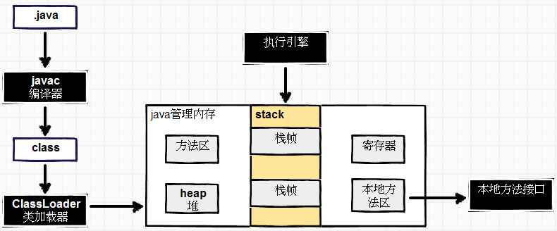
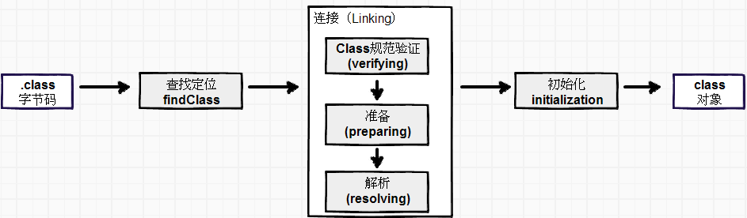
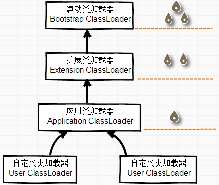
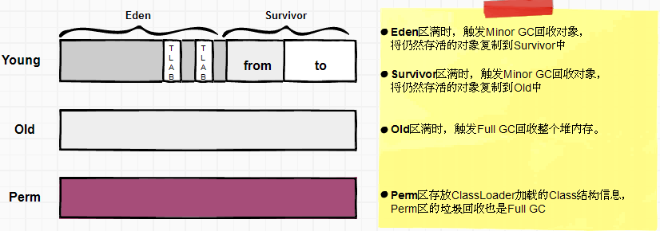

Java-Virtual-Machine
====================
全称java Virtual Machine （Java 虚拟机），通过模拟计算机，达到具备计算机的计算能力。

##computer VS jvm
<table>
	<tr>
		<td width="50%" align="center">computer</td>
		<td  align="center">JVM</td>
	</tr>
	<tr>
		<td><B>指令集</B>：计算机能识别的机器语言。</td>
		<td><B>指令集</B>：符合class规范的字节码</td>
	</tr>
	<tr>
		<td><B>计算单元</B>：能够识别并且控制指令执行功能模块。</td>
		<td></td>
	</tr>
	<tr>
		<td>
			<B>寻址方式</B>：地址的位数、最小地址和最大地址范围，以及地址的运行规则。
		</td>
		<td></td>
	</tr>
	<tr>
		<td>
			<B>寄存器</B>：包括操作数寄存器、变址寄存器、控制寄存器等。
		</td>
		<td>
			<B>内存区</B>：将内存划分成若干个区以模拟实际机器上的存储、记录和调度功能模块。
		</td>
	</tr>
	<tr>
		<td>
			<B>存储单元</B>：能够存储操作数和保存操作结构的单元，如内核缓存、内存和磁盘。
		</td>
		<td><内存区></td>
	</tr>
	<tr>
		<td><B>执行引擎</B>：cpu</td>
		<td>
			<B>执行引擎</B>：解析字节码指令，得到结果。本质上是执行一个个方法所串联起来的执行流程，对应到操作系统是一个java线程(一个执行引擎实例)，jvm实例会同时执行多个执行引擎实例。
		</td>
	</tr>
</table>

## jvm结构体系

###编译器(java compiler)
javac能将符合java语言规范的`.java`文件转化成符合jvm语言规范(`.class`文件)，然后，再由jvm语言将`.class`文件转化成当前机器能够识别的机器语言。
 
jvm起到跨平台作用，屏蔽不同种类、不同平台机器之间的差别。
相对其他语言（C、C++、汇编语言）而言，多一层转换，牺牲了一点效率，但是屏蔽很多和目标机器相关细节。

###类加载器(class loader)
类加载器负责将class文件加载到JVM内存中，需要经过的步骤如下： 

- **查找定位(findClass）**：通过URL的形式来表示ClassPath路径。根据路径的不同分别创建FileLoader或JarLoader。
Class读取的途径，可以是“从ZIP、JAR、EAR、WAR”中读取；从网络中读取；其他文件生成，如JSP；从数据库中读取等。

- **规范验证（verifying）**：确保Class文件的字节流中包含的信息符合当前虚拟机规范，并不会危害虚拟机自身的安全。
包括：文件格式验证（验证字节流是否符合Class文件规范，并且能被当前版本的虚拟机所处理）、
元数据验证（对字节码描述的信息进行语义分析，以保证其描述的信息符合JAVA语言规范的要求）、字节码验证、符号引用验证。

- **准备（preparing）**：正式为类变量分配内存并设置**类变量**初始值的阶段，这些变量所使用的内存都将在方法区中进行分配，而不包括实例变量，
实例变量将会在对象实例化时随着对象一起分配在java堆中。

- **初始化（initization）**：执行类构造器**&lt;clinit&gt;()**方法的过程。

>***类变量***：被static修饰的变量：其初始值是数据类型的零值， static final修饰的类变量：会在准备阶段进行赋值。
>
> ***&lt;clinit&gt;()***：编译器自动收集类中的类变量的赋值动作和静态语句块中的语句合并产生的。
> `<clinit>()方法`，它不需要显示地调用父类构造器，虚拟机会保证在子类的`<clinit>()`方法执行之前，父类的`<clinit>()`方法已经执行完毕。
> 虚拟机会保证一个类的`<clinit>()`方法在多线程环境中被正确地加锁、同步。如果多个线程同时去初始化一个类，只会有一个线程去执行类
> 的`<clinit>()`方法，其他线程阻塞等待。在实际应用中这种阻塞往往是很隐匿的。

####类加载器工作机制

 

使用组合关系来复用“父”加载器。
如果一个类加载器收到类加载请求，它首先不会自己尝试加载，而是把这个请求委派给父类加载器完成，
只有当“父”加载器反馈自己无法完成这个加载请求，子加载器才会尝试自己去加载。

- **启动类加载器（Bootstrap ClassLoader）**：使用C++语言实现，是虚拟机自身的一部分。
负责将存放在JAVA_HOME/lib目录中虚拟机能识别的类库，加载到jvm内存中，如rt.jar。

- **扩展类加载器（Extension ClassLoader）**：负责加载JAVA_HOME/lib/ext目录中的类库。

- **应用类加载器（Application ClassLoader）**：负责加载用户ClassPath路径下的类库。

- **自定义类加载器（user-defined ClassLoader）**：继承相应的XXXClassLoader类，重写findClass方法。

**自定义类加载器，应用场景**： 

- 在自定义路径下查找Class文件，而非设置好的ClassPath路径。
- 对加载的类做特殊处理，如保证通过网络传输的类的安全性。
- 实现类的热部署。

**备注** 
对于任意一个类而言，通过加载它的类加载和类本身一同确认其在java虚拟机中的唯一性。通俗讲：比较两个类是否“相等”，
只有在这两个类是由同一类加载器加载的前提下才有意义。

##jvm内存
###引言
操作系统（Operating System）内存管理是按照进程来管理的，每个进程拥有一段独立的地址空间，互不重合。
OS保证每个进程只能访问自己的内存空间，这样保证了程序的安全性。

由于程序越来越大和设计的多任务性，物理内存无法满足程序的需求，这种情况就有了虚拟内存出现。
虚拟内存出现使得多个进程在同时运行时可以共享物理内存。

一个计算机的内存空间，通常划分为**内核空间**和**用户空间**。

- **内核空间**：主要指操作系统运行时用于程序调度、虚拟内存使用或者链接硬件资源等。

- **用户空间**：程序所申请的内存空间。

为保证操作系统的稳定性，用户程序不能直接访问操作系统所使用的内存空间（内核空间），这也是从安全
性上考虑的，如访问硬件资源，如网络连接等，可以调用操作系统提供的接口来实现。每次系统调用，都会存在
两个内存空间的切换，如网络传输。

这种从内核空间到用户空间的数据复制很费时，牺牲部分效率，但是保证运行的安全性和稳定性。
但是已经出现很多其他技术能够减少从内核空间到用户空间的数据复制方式，如“**零拷贝**”技术：linux sendfile方式。

> sendfile详细介绍：[http://www.linuxjournal.com/article/6345?page=0,0](http://www.linuxjournal.com/article/6345?page=0,0) 
> nio的“零拷贝”技术，底层依赖linux的sendfile。

###堆（heap）

堆是存储java对象的内存区域，被所有线程共享。 
堆的大小在JVM启动时一次向OS申请完成，即可以实现成固定大小，也可以是扩展的（`-Xmx`：堆的最大大小，`-Xms`：初始大小）。 
堆空间符合划分，依据gc算法来定，下面主要以介绍hostspot中使用的基于分代的垃圾收集方式，
可以将堆划分成**Young**区、**Old**区和**Perm**区，分别存储不同年龄的对象。

 
**TLAB**(Thread Local Allocation Buffer)：线程共享Java堆可能划分多个线程私有的分配缓冲区。

###栈（stack）
栈是线程私有的，每当创建一个线程时，JVM就会为这个线程创建一个对应的栈，它的生命周期与线程相同。 
虚拟机栈描述的是JAVA方法执行的内存模型，每个方法在执行的同时都会创建一个栈帧（Stack frame），栈帧用于存储方法中定义的**局部变量表**（Local Variable Table）、**操作数栈**(Operand Stack)、**动态链接**(Dynamic Linking)、**返回地址**（Return Adress）等信息。

- **局部变量表**（Local Variable Table）：是一组变量值存储空间，用于存放方法参数和方法内部定义的局部变量。

