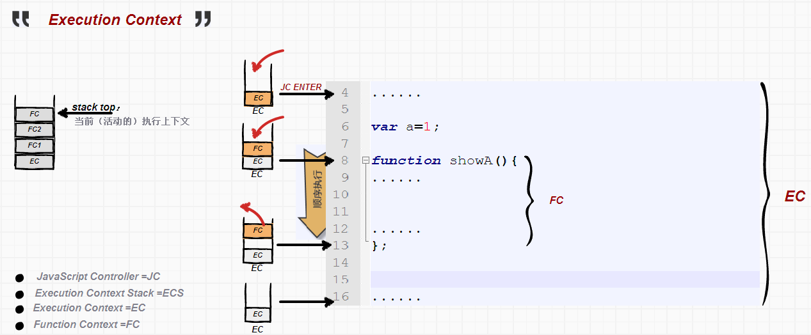
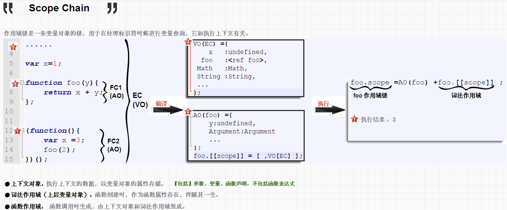

##Scope
In JavaScript, scope is the context in which code is executed. 
typically, scope is used to define the extent of information hiding—that is,  
the **visibility** or **accessibility** of variables from different parts of the program

- global scope
- function scope
- block scope
- lexical scope
- dynamic scope

###global scope
The global scope is the last stop in the **scope chain**,therefore,
Variables defined in the global scope can be accessed from anywhere. 
**Dangers**: any piece of code can change global variables for any reason at any time

> **Notes** 
> 
> one global scope is used by a JavaScript environment 
> when variable declared,not recommended way that lack `var`

<pre><code>
var g1 =123; // g1 be created in global scope

// global scope
(function(){
    g2 =123; // g be created in global scope
})();
</code></pre>

###function scope

